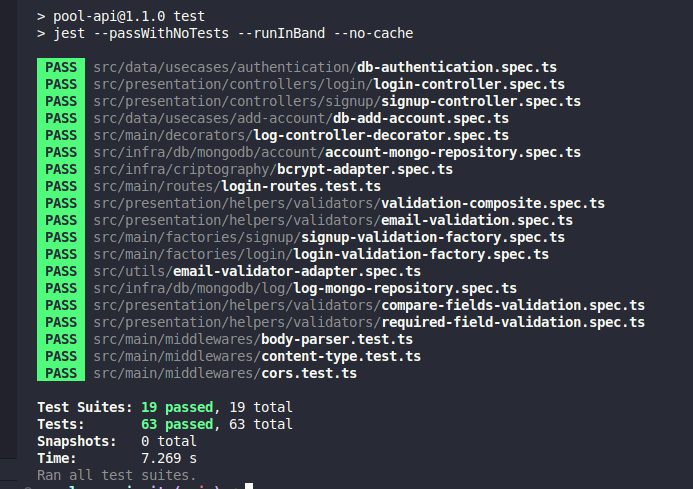

<p align="center">
  <h1 align="center">Clean API</h1>
  <div align="center">
   <table>
      <tr>
         <td>
            
         </td>
      </tr>
   </table>
  </div>
</p>

## 🌐 Demonstração

## 📘 Sobre o Projeto

O objetivo do projeto é praticar o conhecimento adquirido para criar uma API com arquitetura bem definida e desacoplada, utilizando TDD (programação orientada a testes) como metodologia de trabalho, Clean Architecture para fazer a distribuição de responsabilidades em camadas, sempre seguindo os princípios do SOLID e, sempre que possível, aplicando Design Patterns para resolver alguns problemas comuns.

# 📚 Funcionalidades

- [x] API Rest com Express
- [x] Segurança (Hashing, Encryption e Encoding)
- [x] CORS
- [x] Middlewares
- [x] POO Avançado
- [x] Interface
- [x] Testes Unitários
- [x] Testes de Integração
- [x] Cobertura de Testes e Mocks
- [x] Connect e Reconnect
- [x] Login
- [x] Cadastro

## 💻 Tecnologias e Bibliotecas

Este projeto foi desenvolvido utilizando-se das seguintes tecnologias e bibliotecas:

- NPM
- Typescript
- Git
- Jest
- Supertest
- MongoDb
- Bcrypt
- JsonWebToken
- Faker
- Validator
- Express
- Husky
- Lint Staged
- Eslint
- Sucrase
- Rimraf

## 🚧 Pré-requisitos

Para rodar este projeto, você precisará de:

- Node.js (versão 18.0 ou superior)
- Git
- npm

## 🛠️ Instalação

Siga estes passos para configurar o projeto localmente:

1. **Clonar o Repositório:**

   ```bash
   git clone git@github.com:jeanmbiz/clean-api.git
   cd clean-api
   ```

2. **Instalar Dependências:**

   ```bash
   npm install
   ```

3. **Iniciar o Projeto:**
   ```bash
   npm start
   ```

## 🤝 Como Contribuir

Sua contribuição é bem-vinda! Se você tiver sugestões para melhorar este projeto, sinta-se à vontade para fazer um fork do repositório, realizar as mudanças e criar um pull request. Seu feedback é muito valioso.

## 📜 Licença

Este projeto está sob licença MIT. Veja o arquivo [LICENSE](LICENSE) para mais detalhes.

<p align="center">Desenvolvido por Jean Michel Biz</p>